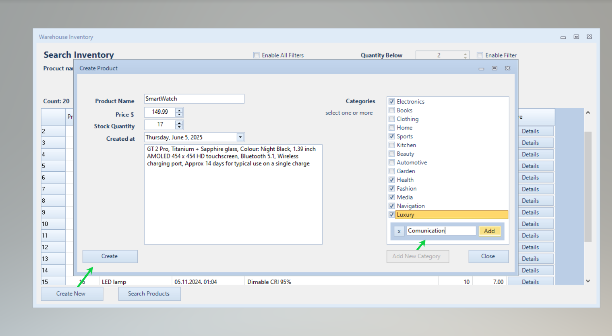

# Warehouse
Windows Forms-based UI that interacts with an MSSQL database through an ASP.NET Core API via HTTP client, utilizing Entity Framework to manage many-to-many relationships in the database.

The Desktop UI contains filtering by Name, Date Added, Price Range and Quantity. Every filter (except Name) can set its range from-, -to or both depending which group the user activate by clicking the button to the left. Search by Name is not case sensitive and it searches the Item Names containing search string.

REST API comunicates with Microsoft SQL Server database which contains many-to-many retlated Entities: Items, Categories and bridging table

#### UI desktop application  
.NET Framework 4.8  

#### REST API  
.NET 7.0  
Microsoft.EntityFrameworkCore.Tools verziju 7.0.20  

#### How to run
 - Clone the project from GitHub locally
 - Run the solution in folder `API/WarehouseApi/`
 - Before creating migrations, add `"ConnectionStrings"` in `API/WarehouseApi/appsettings.json`
 - Models are located in a separate library that is properly referenced in csproj file  
`<ProjectReference Include="..\..\Models\WarehouseModels\WarehouseModels.csproj" />`
 - Context class `WarehouseContext.cs` is already pushed on GitHub and ready for migrations.
 - Create migrations
 - Run migrations
 - Add Categories to `dbo.Category` until I implement a data seeder //TBD
>INSERT INTO dbo.Category (CategoryName, CreatedAt)  
VALUES  
('Electronics', '2024-09-11 20:37:35.0433333'),  
('Books', '2024-09-09 20:37:35.0433333'),  
('Clothing', '2024-07-08 20:37:35.0433333'),  
('Home', '2024-10-08 20:37:35.0433333'),  
('Sports', '2024-07-08 20:37:35.0433333'),  
('Kitchen', '2024-10-08 20:37:35.0433333'),  
('Beauty', '2024-10-10 20:37:35.0433333'),  
('Automotive', '2024-10-11 20:37:35.0433333'),  
('Garden', '2024-10-08 20:37:35.0433333'),  
('Health', '2024-10-11 20:37:35.0433333');
 - run the solution in folder `API/WarehouseApi/`
 - copy the url from browser that displays WarehouseApi methods via Swager UI
 - run the solution in folder `UI/WarehouseUI/`
 - paste the url into the dedicated field at the bottom of the form
 - click `Search`
