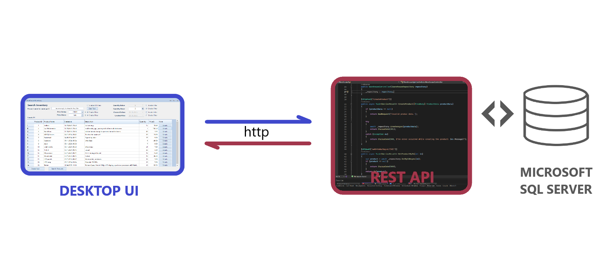
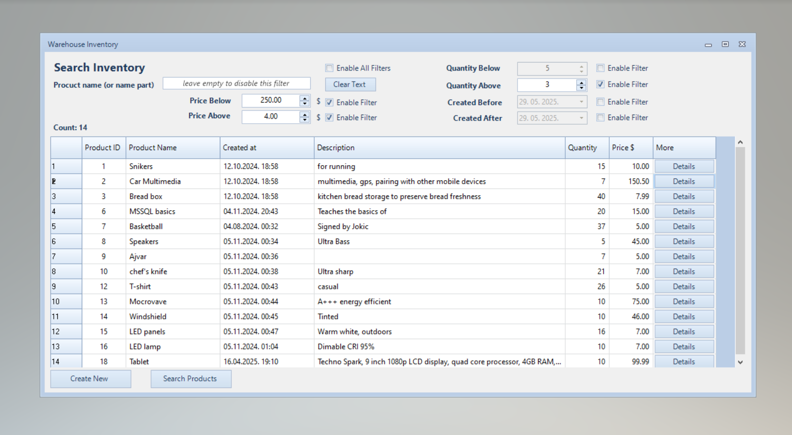
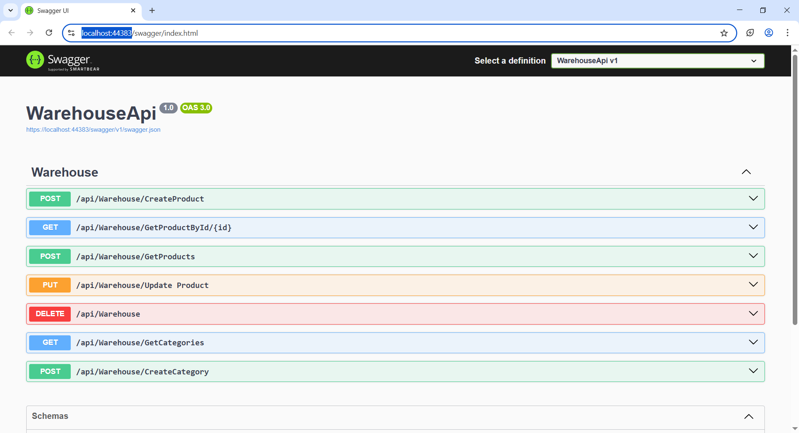

# Warehouse
Windows Forms-based UI that interacts with an MSSQL database through an ASP.NET Core API via HTTP client, utilizing Entity Framework to manage many-to-many relationships in the database.

The Desktop UI contains filtering by Name, Date Added, Price Range and Quantity. Every filter (except Name) can set its range from-, -to or both depending which group the user activate by clicking the button to the left. Search by Name is not case sensitive and it searches the Item Names containing search string.

REST API comunicates with Microsoft SQL Server database which contains many-to-many retlated Entities: Items, Categories and bridging table

